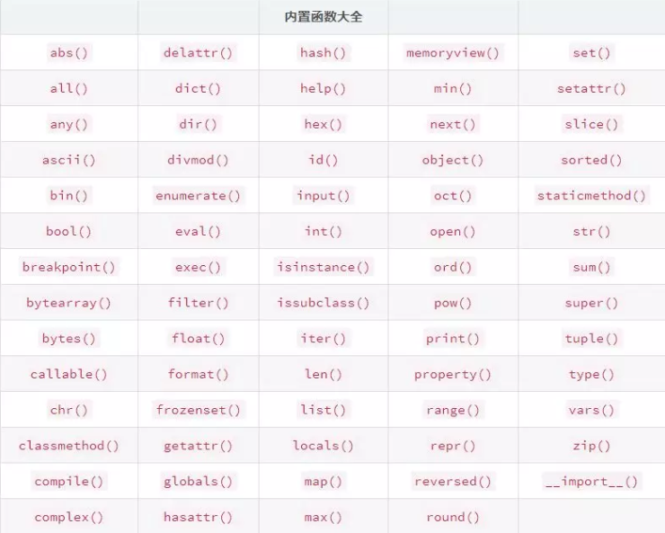

# 内置函数

Python3 解释器中内置了 69 个常用函数，属于底层的函数，它们到处可用。有些对大家来说比较熟悉，比如 abs (), max (), sum ()... 也有一些比较陌生，比如 locals (), all (), compile (), getattr ()... 今天按照类别扼要总结。

## 1 类型相关

69 个内置函数中，与类型相关的指，把入参包装为某种类型，这样的内置函数包括：

- bool()  #d布尔型
- int()  #d整形
- str()  #d字符型
- tuple() #d元包型
- dict() #d字典型
- list() #d列表型
- zip() #可迭代对象聚合，(,)
- complex() #d复数型
- float() #d浮点型
- bytes() #d字节型数组
- bytearray() #d字数数组
- range() #d不可更改的序列
- object() #d无属性的根类
- set() # 集合类型
- frozenset() # 冻结集合类型，不允许修改
- slice() # 返回一个slice对象，其中start, stop, step等都是只读的`


比如 bool (x)，将入参 x 封装为 Boolean 类型，返回值为 True 或 False

- bool(10)

>True

- bool(0)

>False

- bool(\'false\')

>True

- bool(0.0)

>False

关于 bytes () 和 bytearray () 的用法可参考：

https://www.cnblogs.com/sesshoumaru/p/5980090.html


## 2 数理统计相关


有的内置函数可以完成简单的数理统计工作，这样的内置函数包括：

- abs() #d绝对值
- min() #d最小
- max() #d最大
- sum() #d求和
- pow() #d求次幂
- all() #d所有元素为true则为true
- any() #d至少一个元素为true则为true
- divmod() #d(商，余数)
- round() #四舍五入
- Vlen() #参数元素个数


- any () 函数代码等价于以下 5 行代码：

def any(iterable):

for element in iterable:

if element:

return True

return False

- divmod 函数：

divmod(10,8)

> (1,2)


## 3 进制转换


有些内置函数可以帮助我们轻松实现进制转换，比如：

- chr() #unicode编码
- ord() #chr()反操作
- bin() #转化为ob开头的二进制字符
- hex() #转化为ox开头的十六进制字符
- ascii() #可打印表示对象，类似于 repr()
- oct() # 转化为0o开头的八进制字符


## 4 面向对象相关


Python 提供与对象属性相关的操作函数，它们为满足 Python 属性的动态调整提供了可能。

- setattr(object, name, value) #为对象设置属性
- delattr(object, name) # 删除命名的属性
- getattr(object,name) #获取属性的取值，如果对象无此属性，会抛异常
- getattr(object,name, 123) #即便无此属性，也不会抛异常，会返回123
- hasattr(object,name) # 判断name属性是否属于object
- isinstance(object, classinfo) #判断object是classinfo的实例吗
- issubclass(class, classinfo) # 判断class是否为classinfo的子类
- super() #调用父类， 方法
- property() #特性相关，@property标记为属性
- type() #返回实例的类型
- vars() # 返回对象的信息等
- classmethod() # 转化方法为类方法
- staticmethod() #方法是静态方法

比如，

setattr(x,\'footbar\',12) #等价于 x.footbar=12
issubclass(list,object)
> True
issubclass(object,list)
> False


## 5 迭代器相关


next, reversed, iter (), enumerate () 这些都是与迭代相关的函数，比如以下，就是返回一个逆向迭代器：


rev = reversed([1,-2,4,0])
for i in rev:
print(i)
 > 0
 4
 -2
 1


iter 函数使用例子

iter(\'abc\')
> <str_iterator at 0x8b9fba8>
for i in iter(\'abc\'):
  print(i)
> a
b
c


## 6 map 函数


map 函数的原型为：map (function, iterable, ...) ，返回一个迭代器，在每一个可迭代对象的元素上应用 function.


map 应用举例：

def f(x):
  reutn x**2

 mymap = map(f, [1,2,3]) # 返回一个迭代器

 for i in mymap:
   print(i)
  > 1
  4
  9


## 7 排序相关


sorted 返回一个排序好的列表，比如：


li = [1,-2,4,0]
sorted(li)
> [-2,0,1,4]


## 8 其他


compile 函数与源码编译相关；memoryview 函数与内存视图相关；help 查看帮助；dir 查看对象的方法和属性；更多见下表：


- hash() # 返回对象的哈希码
- id() #返回一个对象的标识
- input()  #与标准输出相关
- breakpoint() #调试相关
- exec() #动态执行Python代码
- callable() #判断对象是否可调用
- format() #对象格式化


format 是一个比较常用的，用于格式化输出的函数，详细的格式化参数标准形式，参考文档：https://docs.python.org/3/library/string.html#formatspec


参考官网：

https://docs.python.org/3/library/functions.html

# 纲要

Python 作为一门高级编程语言，为我们提供了许多方便易用的内置函数，节省了不少开发应用的时间。目前，Python 3.7 共有 69 个内置函数，一些是我们耳熟能详的函数，另一些却不是很常见，这里主要介绍一些新手必备函数及其用法。



为了便于说明，把这些内置函数粗略地分为六大类：

```
输入输出	 print() open()  input()
迭代相关	 enumerate()  zip()
序列属性	 sum()  max()  min()  len()
操作序列	 sorted()  reversed()  range()
对象属性	 dir()  id()  isinstance()  type()
映射类型	 eval()  map()  slice()
```

# 输入输出

## print 函数将对象输出至控制台

```
print(*objects, sep=' ', end='\n', file=
sys.stdout, flush=False)
```

*objects 为可变参数，可以接受任意多个对象。sep 参数表示输出对象之间的分隔符，默认为空格。

```
>>> print('Python', '高效编程')
Python 高效编程
```

分隔符为 '*':

```
>>> print('Python', '高效编程', sep = '*')
Python*高效编程
```

格式化输出字符串的三种方式：

```
name = 'Python高效编程'
fmt1 = f'公众号：{name}'
fmt2 = '公众号：{}'.format(name)
fmt3 = '公众号：%s' %name
print(fmt1)
print(fmt2)
print(fmt3)
# 公众号：Python高效编程
```

## open 函数打开文件并返回文件对象

```
open(file, mode='r', buffering=-1,
encoding=None, errors=None, newline=
None, closefd=True, opener=None)
```

file 为文件地址，mode 为打开文件的模式，默认为 'r'，表示读取文件，常用的还有：'w' 表示写入文件、'b' 表示以二进制形式打开。

常用上下文管理器 with 打开文件，f.read () 读取全部内容，f.readline () 读取一行内容。


```
with open('test.txt', 'r') as f:
   text1 = f.read()

with open('test.txt', 'r') as f:
   text2 = ''
   line = f.readline()
   while line:
       text2 += line
       line = f.readline()

assert text1 == text2
print(text1)

###############
输出内容：
Python 高效编程
Python 高效编程
Python 高效编程
Python 高效编程
###############
```

有时候，我们读取文件还会遇到乱码问题，可以指定编码格式：

当文件中有中文的时候，使用 'utf-8' 编码会导致异常：UnicodeDecodeError: 'utf-8' codec can't decode byte 0xb8 in position 7: invalid start byte

```
with open('test.txt', 'r',
       encoding='utf-8') as f:
   text1 = f.read()
```

这时候，我们可以尝试 'gb2312' 或者 'gbk' 编码来打开含有中文字符的文件。这时，便可以成功打开文件。

```
with open('test.txt', 'r',
       encoding='gb2312') as f:
   text1 = f.read()

with open('test.txt', 'w',
       encoding='gbk') as f:
   f.write('Python高效编程')
```

## input 函数获取控制台输入

```
input([prompt])
```

input 可接受字符串为参数，提示用户输入。

```
>>> s = input('请输入公众号名称：')
请输入公众号名称：Python高效编程
>>> s
'Python高效编程'
```

# 迭代相关

## enumerate 函数返回元素的序号与对应值

```
enumerate(iterable, start=0)
```

iterable 参数表示可迭代对象，start 参数是元素序号的起点，默认为 0。

enumerate 函数的等价形式如下：

```
def enumerate(sequence, start=0):
 n = start
 for elem in sequence:
     yield n, elem
     n += 1

seq = ['P', 'y', 't', 'h', 'o', 'n']
for i, elem in enumerate(seq):
   print(i, elem)
```

## zip 函数用于同时迭代多个对象

```
zip(*iterables)
```

*iterable 可以接受任意多个可迭代对象

```
a = ["**", '**', '**']
b = ['微信公众号', '关注', 'Python高效编程']
c = a
print('#'*20)
for i, j, k in zip(a, b, c):
   print(i, j, k)
print('#'*20)

####################
** 微信公众号 **
** 关注 **
** Python高效编程 **
####################
```

# 序列属性

## 序列最大值：max

## 序列最小值：min

## 序列的和：sum

## 序列长度：len

基本用法：向这四个函数中传入序列，可以得到对应属性。

```
import random
random.seed(21)
seq = [random.randint(0, 100) for i in range(10)]
print(seq)
# [21, 53, 88, 53, 81, 36, 61, 27, 60, 65]
print(max(seq))
# 88
print(min(seq))
# 21
print(sum(seq))
# 545
print(len(seq))
# 10
```

作为内置函数，可以直接传入生成器（不需要括号）作为参数：

```
import random
random.seed(21)
num = max(random.randint(0, 100) for i in range(10))
print(num)
# 88
```

可传入 key 参数，作为比较大小的依据，相当于把序列中每一个元素 item 先传入函数 key 中，将函数返回的数值作为判断对象大小的依据。

```
def foo(x):
   return 1. / x
max(seq, key = foo)
# 21
```

对于我们自定义的类型，必须实现特殊方法，才能进行 len 等操作。

__len__ 代表：len 操作，__eq__ 代表：= 操作，__lt__ 代表 < 操作。

```
class foo:
   def __init__(self, num, seq):
       self.num = num
       self.seq = seq

   def __len__(self):
       return len(self.seq)

   def __eq__(self, other):
       return self.num == other.num

   def __lt__(self, other):
       return self.num < other.num

>>> f1 = foo(18, [1, 4, 6])
>>> f2 = foo(21, [1, 7, 9, 10])
>>> f1 < f2
True
>>> f1 > f2
False
>>> f1 == f2
False
>>> f3 = foo(18, [9, 9, 0, 7])
>>> f1 == f3
True
>>> len(f1)
3
>>> len(f2)
4
```

# 操作序列

## range 函数生成序列

```
range(start, stop[, step])
```

start 可选参数，默认为 0 ，表示序列起点

stop 必选参数，表示序列终点，不包括终点

step 可选参数，序列的步长，默认为 1

```
>>> range(6)
range(0, 6)
>>> list(range(6))
[0, 1, 2, 3, 4, 5]
>>> list(range(0, 6, 2))
[0, 2, 4]
```

range 函数生成的对象可以迭代，和列表很类似，_ 表示废弃变量（为了避免污染变量环境）：

```
for _ in range(3):
 print('Python高效编程')
```

## reversed 函数可以将序列逆置

reversed 可以将序列逆置，包括元组、字符串、列表。对于列表和字符串的逆置，使用 list [::-1] 或者 slice () 更加方便。

```
import random
random.seed(21)
seq = [random.randint(0, 100) for i in range(10)]
print(seq)
# [21, 53, 88, 53, 81, 36, 61, 27, 60, 65]
reversed(seq)
print(list(reversed(seq)))
# [65, 60, 27, 61, 36, 81, 53, 88, 53, 21]
```

字符串逆置：

```
>>> a = 'Python高效编程'
>>> a[::-1]
'程编效高nohtyP'
>>> ''.join(reversed('Python高效编程'))
'程编效高nohtyP'
```

## sorted 函数可以对序列进行排序

```
sorted(iterable, *, key=None, reverse=False)
```

sorted 不同于 list.sort 操作（原地排序），返回一个新的有序序列，原序列保持不变。* 表示仅限关键字参数 (keyword-only)，也就是说，key、reverse 参数只能通过关键字传参，而不能通过位置传参。reverve 参数表示逆置操作，key 与之前 len 中的 key 参数类似，是函数排序的依据。

```
>>> sorted([9, 6, 2, 3, 6])
[2, 3, 6, 6, 9]
```

# 对象属性

## dir 函数返回属性列表

## id  函数返回对象地址

## isinstance  判断对象的类型

## type 返回对象的类型

```
class foo:
   pass

>>> dir(foo)
['__class__',
'__delattr__',
'__dict__',
'__dir__',
......
'__str__',
'__subclasshook__',
'__weakref__']
# 创建实例
>>> f = foo()
>>> type(foo)
__main__.foo
>>> isinstance(f, foo)
True
>>> id(f)
2135099584864
```

# 映射类型

## eval 解除引号的束缚

## map 应用函数于单个对象

## slice 生成切片

eval 可以去除字符串的单引号，从而获取引号内部内容。下面的演示展示了，如何使用 eval 函数获取字符串中的字典：

```
>>> info = '{"name": "LiHua", "age": 12}'
>>> eval(info)
{'name': 'LiHua', 'age': 12}
>>> info_dict = eval(info)
>>> type(info_dict)
dict
```

map 将传进来的函数应用于序列中的每一个元素，并返回迭代器。

```
map(function, iterable, ...)
```

举例来说，map 就是对 seq 列表中的每一个元素 item 进行 int 操作 (int (item))。匿名函数同理，就是对序列中的每一个元素进行加 2 的操作。

```
>>> seq = [1.5, 4.5, 9.1]
>>> list(map(int, seq))
[1, 4, 9]
>>> list(map(lambda x: x + 2, seq))
[3.5, 6.5, 11.1]
```

slice 函数为切片操作命名，使得切片操作更加清晰明了。

```
slice(start, stop[, step])
```

start 为起点，stop 为终点，step 为步长。使用该操作，使得截取有规律的文本内容变得很轻松。特别是长文本，使用 slice 函数更加清晰易懂。

```
>>> text = '微信公众号 Python高效编程'
>>> name = slice(0, 6)
>>> text[name]
微信公众号
>>> content = slice(6, 16)
>>> text[content]
Python高效编程
```